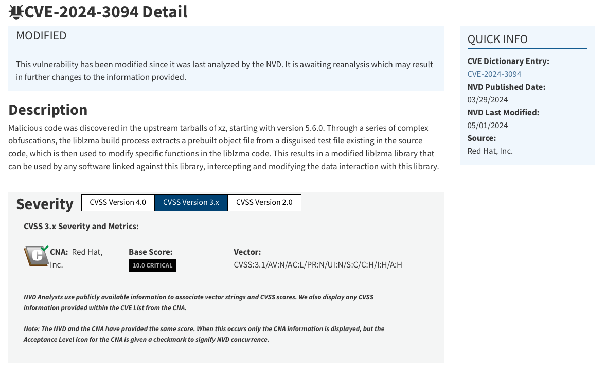

# Cosa contiene questo repository?

Questo repository contiene una breve ricerca e una presentazione della falla di sicurezza riguardante XZ Utils per il corso di sicurezza informatica UNIPR 

# CVE-2024-3094
Descrizione della falla da parte di Ubuntu: 

Malicious code was discovered in the upstream tarballs of xz, starting with version 5.6.0. Through a series of complex obfuscations, the liblzma build process extracts a prebuilt object file from a disguised test file existing in the source code, which is then used to modify specific functions in the liblzma code. This results in a modified liblzma library that can be used by any software linked against this library, intercepting and modifying the data interaction with this library.

