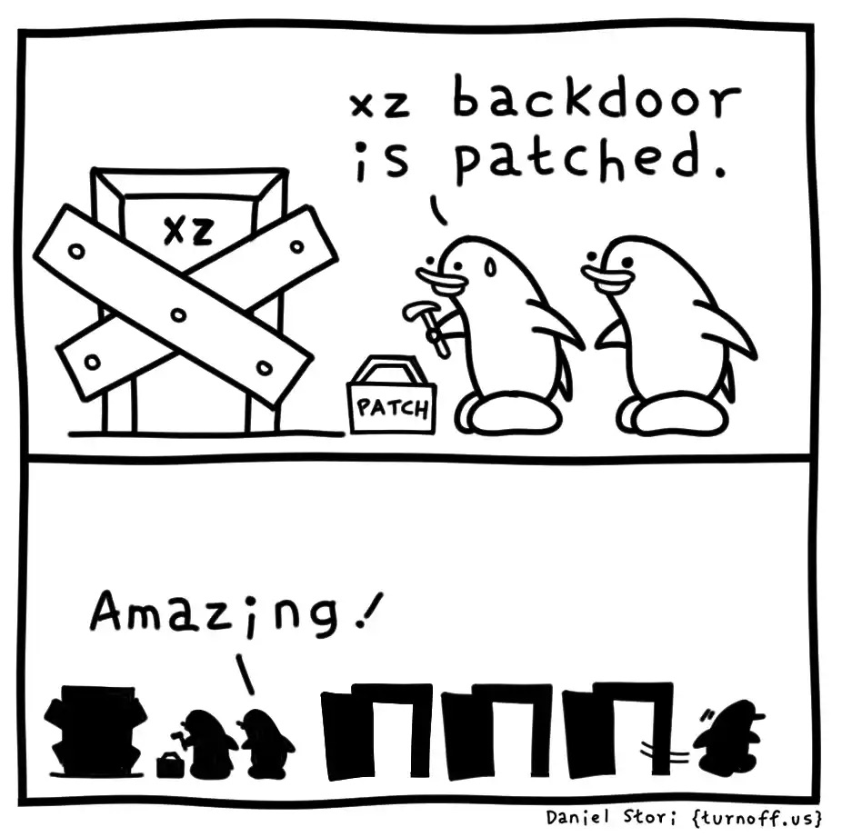

# CVE-2024-3094: XZ Utils Backdoor

## Descrizione degli eventi:
Il 29 marzo 2024 Andres Freund, ricercatore presso Microsoft, ha scoperto che le versioni 5.6.0 di XZ Utils contenevano un backdoor che permetteva ad attaccanti remoti non autenticati di un eseguire codice arbitrario sui sistemi vulnerabili, bypassando l'autenticazione SSH.

XZ Utils è un progetto software opensource che mette a disposizione una libreria (libzma) utilizzata da molti progetti per la compressione e decompressione di file. In particolare, la falla sfruttava la sua rilevanza all'interno di Systemd (libsystemd) e OpenSSH.

L'introduzione del backdoor è stata un'operazione complessa, attuata nell'arco di tre anni da un utente chiamato JiaT75, sostenuto da diverse identità fittizie che avevano il compito di spingere il gestore della libreria a lasciase sempre più responsabilità al nuovo manutentore del progetto.
JiaT75 è riuscito gradualmente a guadagnare la fiducia del manutentore e a impiantare il codice malevolo della fase di distribuzione della libreria.

La backdor, sfruttando la mala gestione della pipeline di Test della libreria, ha iniettato nel codice sorgente di XZ uno script con l'obiettivo di decomprime ed eseguire un oggetto binario contenente il payload vero e proprio.
Il malware sostituisce la funzione RSA_decrypt di OpenSSH per verificare ed eseguire comandi firmati con la chiave privata dell'attaccante.

Prima di scoprire la falla diversi account anonimi avevano iniziato a sollecitare l'adozione della nuova versione di XZ Utils, contenente la backdoor, presso i gestori delle principali distribuzioni Linux. Questo sforzo di "ingegneria sociale" durò anni e aveva come obiettivo la diffusione indiretta della backdoor nei diversi sistemi critici che utilizzavano la libreria.

Sebbene non ci siano prove di uno sfruttamento attivo della falla, CVE-2024-3094 è stata classificata con il massimo livello di gravità (CVSS 10.0) poichè avrebbe potuto abilitare l'esecuzione remota di codice tramite il servizio SSH. 

Per essere vulnerabili, i sistemi devono eseguire
- Linux x86/64
- avere le versioni compromesse di XZ Utils
- esporre il servizio SSH.
- avere una distribuzione che collega SSHD a libsystemd 
- SSHD deve essere lanciato come servizio di systemd

L'impatto della vulnerabilità è stato minimo grazie alla scoperta di Freund, ma sarebbe potuto essere uno degli incidenti più gravi della storia della sicurezza informatica.

## Perchè XZ utils è stato il bersaglio di un attacco?

Probabilmente la scelta di XZ Utils come bersaglio di un attacco così importante è stata dettata dalla sua rilevanza all'interno di molti progetti e allo stesso tempo dalla fragilità nella sua "leadership", da cui è scaturito un terreno fertile per la proliferazione di utenti malevoli, probabilmente riconducibili ad attori statali.

## Attacchi alla supply chain
L'incidente ha evidenziato i rischi degli attacchi alla supply chain nell'open source e la necessità di maggiori controlli sulle dipendenze critiche, spesso gestite solo da pochi volontari.

Da anni si registrano aumenti degli attacchi diretti ai comparti IT delle aziende a livello locale e internazionale. A questi si aggiungono interdipendenze sempre più complesse che rendono difficile la gestione della sicurezza della supply chain.

Invece che infettare progetti open source, con una migliore gestione e un maggior controllo delle patch sottomesse dai diversi contributori, è stata preferita un'operazione di ingegneria sociale per introdurre una backdoor in un progetto minore alla base di diversi sistemi di maggior rilevnza come Systemd e OpenSSH.

## L'importanza dei progetti Open source

Quando ci sono eventi di questa portata come la CVE-2024-3094, difficilmente ci si concentra sulle cause più profonde che hanno portato alla vulnerabilità e all'ingegneria sociale che ha permesso l'introduzione del backdoor, al contrario spesso si preferisce prolungarsi in discussioni infinite su quale possa essere la pipeline di lavoro che avrebbe potuto evitare la vulnerabilità.

Alla base di questa CVE-2024-3094 è presente uno dei problemi più comuni delle dipendenze all'interno dello sviluppo software: piccoli progetti sostenuti e mantenuti da poche persone diventano la base di sistemi complessi sviluppati da società e organizzazioni in tutto il mondo, senza un'adeguata gestione del rischio e sovvenzionamenti tramite finanziamenti diretti o indiretti.

Finché si farà affidamento, senza adeguato finanziamento e gestione del rischio sui single point of failure, sarà sempre più comune trovare vulnerabilità come CVE-2024-3094.

## Riferimenti

- [CVE-2024-3094](https://cve.mitre.org/cgi-bin/cvename.cgi?name=CVE-2024-3094)
- [Ubuntu Security Notice](https://ubuntu.com/security/CVE-2024-3094)
- [Report Pentest tools](https://pentest-tools.com/blog/xz-utils-backdoor-cve-2024-3094)